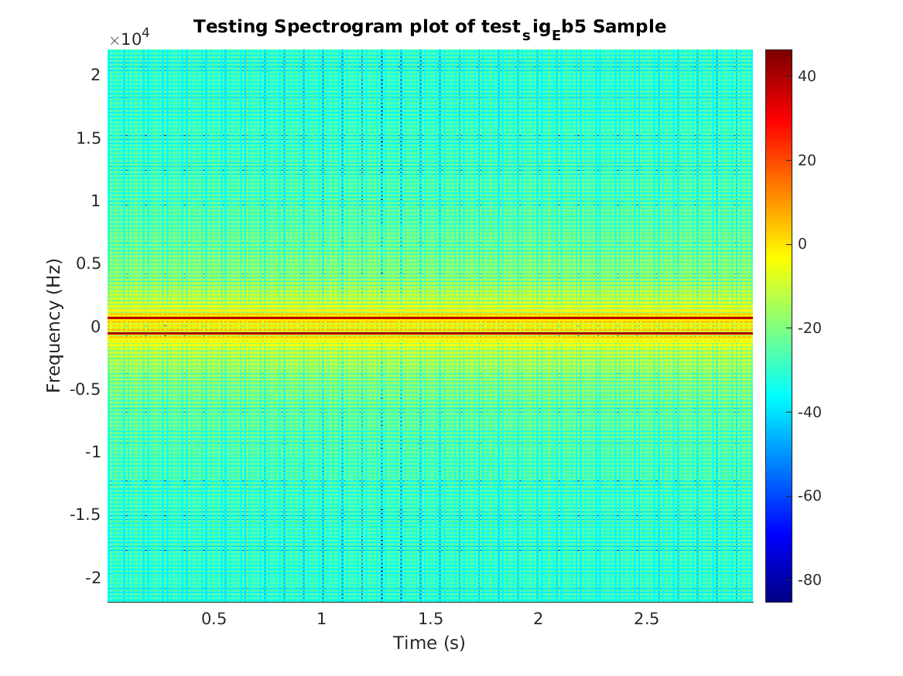
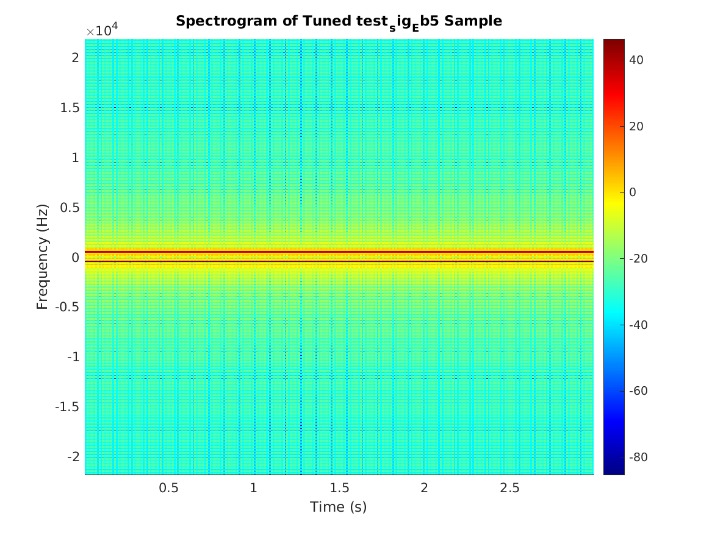
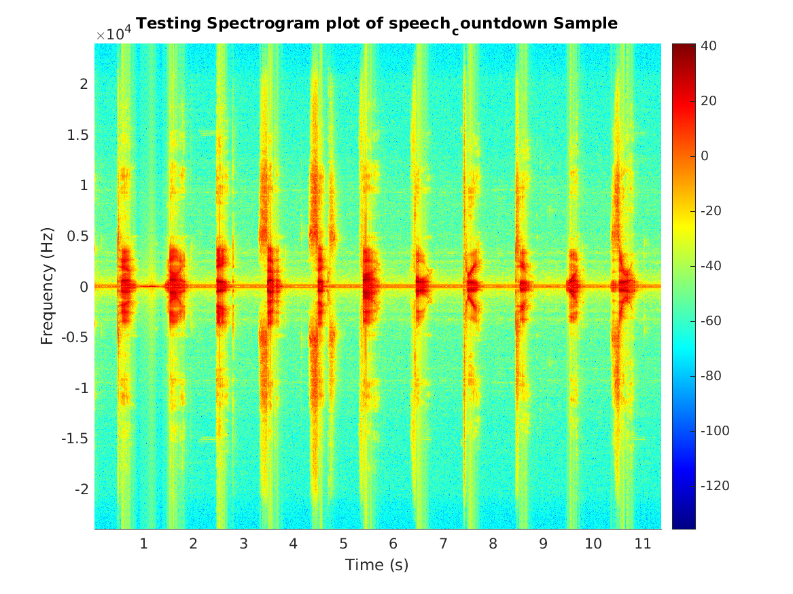
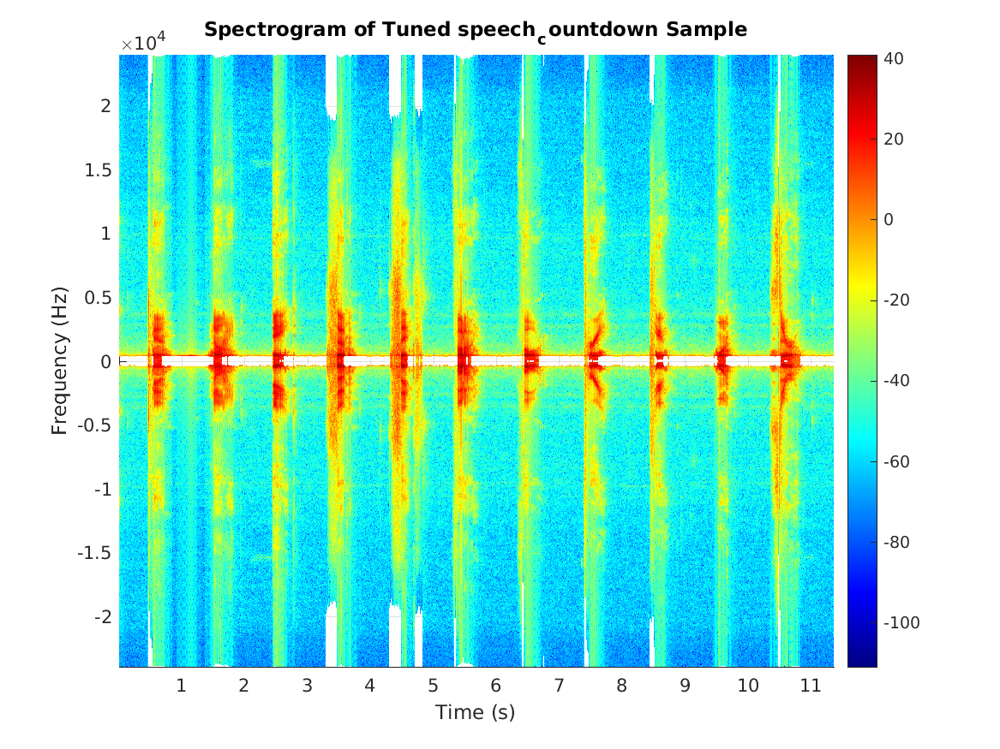
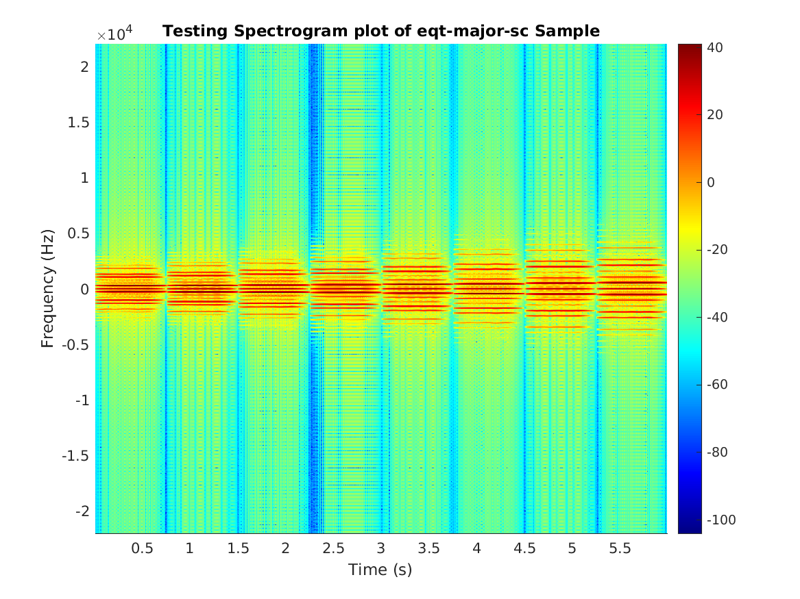
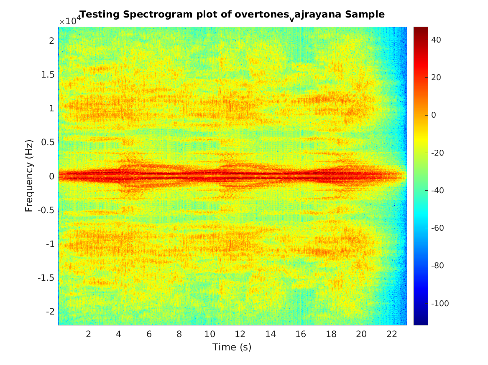
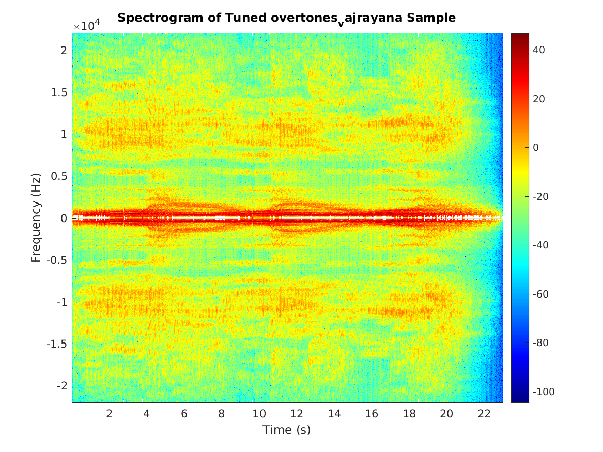
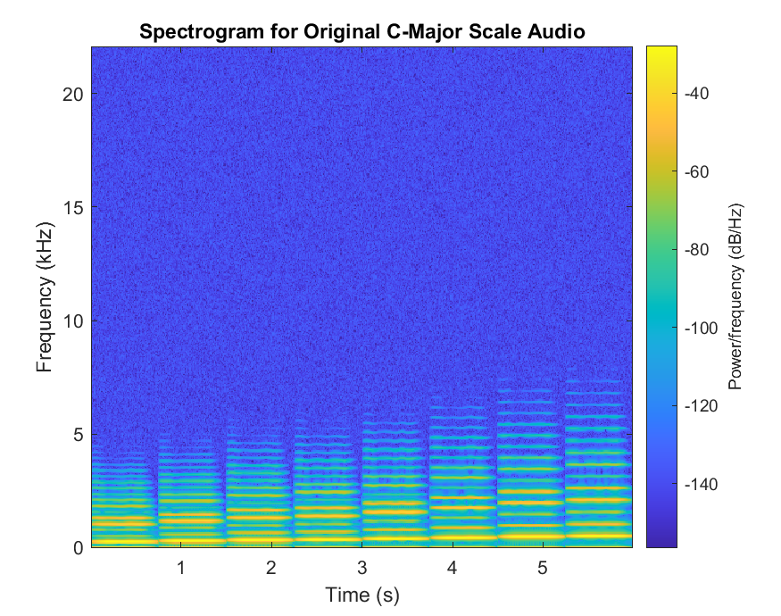
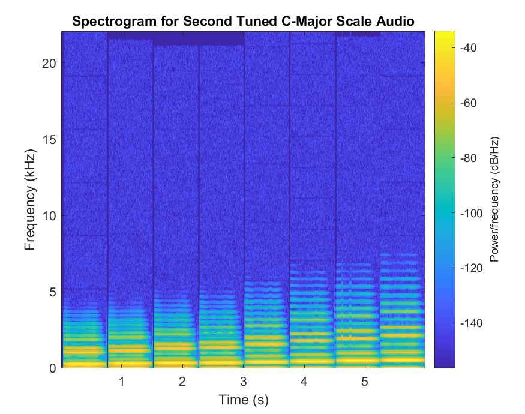

# Autotuning Signals in Matlab

A project by [Lizzy Presland](https://linkedin.com/in/etcadinfinitum), 
[Bo Simmons](https://www.linkedin.com/in/bowman-simmons/), and 
Jayden Fullerton.

## General advice from Stiber (TODO remove this)

Cutting across these topics, your report should make it clear what you learned, relating to both the course material and any unexpected problems or issues that gave you new insight.

## Summary

In this project, we work to create a utility which processes an audio 
file (for example, human speech or synthesized musical notes) and 
and produces an audio which has its pitch corrected to a desired 
frequency in the Western chromatic scale.

## Background

In the music industry, the process of pitch correction, informally known 
as autotuning, is a common practice. Its musical merits are [in constant 
dispute](https://ocw.mit.edu/courses/music-and-theater-arts/21m-380-music-and-technology-contemporary-history-and-aesthetics-fall-2009/projects/MIT21M_380F09_proj_mtech_3.pdf) 
in the music industry, but its prevalence and popularity in many 
genres of popular music has secured the technique's importance in music 
production and in digital signal processing (DSP).

The implementation of an autotuner is closely related to the more general 
DSP technique known as a _phase vocoder_. TODO elaborate

NOTE: An introduction to the application area, including how your project fits into the existing state of the art. You should have done a literature search and read some real (i.e., non-web) reference material.

## Techniques

To analyze the frequency content of the audio signal, we utilized 
short-time Fourier transforms (STFTs) of the input signal. This technique 
decomposes the audio signal into a series of Fourier transforms, which 
allows the time domain signal to be represented as a series of 
frequency domain spectra. With this technique, we can analyze the 
frequency components of a signal to determine which frequency or frequencies 
are represented in a small time window of the signal, and work to make changes 
to that frequency spectrum to achieve our desired results.

TODO: more details about STFT mechanics, paying particular attention 
to the overlap mechanics and window types. Our implementation uses a 
Hamming window; a mathematical and graphical description of this window 
is probably important.

When implementing pitch correction, our first approach was simplistic. 
We elected to locate the frequency with the largest magnitude in each 
column of the STFT, which we assume is the fundamental frequency for that 
transform. We then perform a raw offset of the column containing that transform 
so that the fundamental frequency of each STFT column resided in the frequency-domain 
bin which was closest to the target frequency. 

TODO: secondary technique for pitch correction?

After performing modifications to the signal's STFT, it is necessary to 
convert the frequency domain representation of the modified signal to the 
time domain. To accomplish this, we take the inverse of the STFT, which 
inverts the process used to produce the STFT. First, the inverse FFT of 
each frequency domain window is calculated, and then the time domain 
signal values are rescaled using the inverse of the same mapping used to 
scale the input signal's window. If a Hamming window is used, the reciprocal 
of the scale value for each element is used to rescale each element in 
the inverted FFT. Lastly, if the overlap parameter is non-zero, the resulting 
reconverted signal is cumulatively at the offset specified by the overlap 
parameter.

TODO: citable source is needed; also, diagram of this process would be useful.

NOTE: Course concepts and algorithms covered by the project. This section is the core justification that this project should result in a good grade for you.

## Design

To isolate the processing and transformation of a signal, and the parameters 
required to perform these tasks, we created a class `AutoTuner` to provide 
object members and functions which perform the steps necessary to perform 
pitch correction. Such a structure allows for multiple pitch correction 
approaches to be written and documented. We explicitly decided that the 
client utilizing the class would be responsible for calling the class 
functions which perform pitch correction and convert the frequency domain 
STFT back into a time domain signal. Separating each of these steps gives 
the user greater control over inspecting and graphing the signal at various 
steps in the process.

Furthermore, we also decided that the `AutoTuner` class would not have 
any graphing utilities embedded into the 

NOTE: A complete design description. It should be extensive enough for someone else to continue development of the project.

## Results

### Approach 1: Raw Frequency Domain Offsets

We ran tests on a few sound examples, showing the altered spectrograms 
and resulting sounds.

Here's a simple test which uses an E♭ in the 5th octave as input.

| Original Signal | Output Signal   |
|-----------------|-----------------|
|  |  |
|  <audio controls markdown="0"><source src="./media/audio/straighttoneEb5_original.wav" type="audio/wav">Your browser does not support the audio element.</audio> | <audio controls markdown="0"><source src="./media/audio/v1_straighttone_result.wav" type="audio/wav">Your browser does not support the audio element.</audio> |

We then tested the software on complex and overtone-rich signals.

|--------|-----------------|-----------------|
| Spoken countdown | <br/>Original spectrogram of spoken numerical countdown. | <br/>Spectrogram of speech example after pitch correction is applied. |
| ^^ | Audio files of a) original signal, b) pitch correction reference tone, and c) pitch corrected sound. <br/><audio controls markdown="0" style="width: 100%;"><source src="./media/audio/v1_countdown_result.wav" type="audio/wav">Your browser does not support the audio element.</audio> ||
| Synthesized C major scale | <br/>Original spectrogram of C major scale. | <br/>Spectrogram of C major scale after pitch correction is applied. |
| C Major scale audio results |  Audio files of a) original signal, b) pitch correction reference tone, and c) pitch corrected sound. <br/><audio controls markdown="0" style="width: 100%;"><source src="./media/audio/v1_scale_result.wav" type="audio/wav">Your browser does not support the audio element.</audio> ||
| Buddhist Vajrayana chant | <br/>Original spectrogram of Buddhist vajrayana chant. | <br/>Spectrogram of chant after pitch correction is applied. |
| Buddhist Vajrayana chant audio | Audio files of a) original signal, b) pitch correction reference tone, and c) pitch corrected sound.<br/><audio controls markdown="0" style="width: 100%;"><source src="./media/audio/v1_vajrayana_result.wav" type="audio/wav">Your browser does not support the audio element.</audio> ||

Strictly testing:

$$H(z) = \frac{Y(z)}{X(z)}$$

TODO: write up an analysis of what happened to the audio clips we tried 
to autotune.

### Approach 2: Phase-Vocoder Approach

**TODO: Move this section into "Techniques"**

A second approach was developed in parallel for testing and comparison purposes. This approach, described by Laroche and Dolson (1999), can be outlined as follows:

* Take a Short-Time Fourier-Transform for the input signal.
* Detect peaks within the STFT.
* Calculate frequency shift for each peak.
* Shift the frequency of each peak.
* Inverse the STFT in order to produce a tuned signal.

**END TODO**

**TODO: Flesh out introduction.**

For the purposes of this approach, Matlab’s `spectrogram` function was used rather than the stft function, partially for the purpose of consolidating code where spectrogram’s needed to be produced anyways. The bulk of the process was performed by a single method, `correctPitchSpectrum`. That’s method’s function definition is shown below in Code Block 1.

**Code Block 1: correctPitchSpectrum method for autotuning approach 2**
```matlab
function correctedSpectrum = correctPitchSpectrum(s, f, targetPitches)
    % s - short-time fourier-transform 
    % f - frequency space
    % targetPitches - a vector of pitches to tune to
    % return correctedSpectrum - a vector of the corrected short-time spectrum values
    absS = abs(s);
    y = 20*log10(absS/min(absS(:)));
    % need number of buckets
    numBuckets = length(s(1,:));
    % pre-allocation of return array as Matlab's "intellisense" whinges about it
    correctedSpectrum = zeros(length(s(:,1)),numBuckets);
    % main loop
    for bucket = 1:numBuckets
        % 1) Identify fundamental frequency for each bucket using frequency that corresponds to max amplitude
        selectedPitch = f(find((y(:,bucket) == max(y(:,bucket))),bucket,'first'));
        % 2) individual pitch correction by finding closest value in target table
        [d, idx] = min(abs(targetPitches - selectedPitch));
        correctedpitch = targetPitches(idx);
        % 3) perform pitch shift 
        shiftFactor = correctedpitch/selectedPitch;
        for idx = 1:length(s(:,1))
            shiftval = round(idx/shiftFactor);
            if shiftval <= length(s(:,1))
                if shiftval <= 0 % No negative out of bounds indexing
                    shiftval = 1;
                end
                correctedSpectrum(idx,bucket) = s(shiftval,bucket);
            end
        end
    end
end

```

As a point of comparison between these two approaches, consider the C-Major scale .wav file used for testing purposes above. The output was choppy, an not entirely on pitch. Note that our expectation is no significant pitch change, with a secondary goal of maintaining sound characteristics.

| Original Signal | Output Signal   |
|-----------------|-----------------|
|  |  |
|  <audio controls markdown="0"><source src="./media/audio/scale_original.wav" type="audio/wav">Your browser does not support the audio element.</audio> | <audio controls markdown="0"><source src="./media/audio/v2_scale_result.wav" type="audio/wav">Your browser does not support the audio element.</audio> |

## User Guide

Following these steps will allow anyone to run the software and 
reproduce our results or experiment with user-supplied sound samples.

The relevant structure of our project is as follows:

```
.
├── matlab/
│   ├── AutoTuner.m
│   ├── driver.m
│   ├── pitchTable.m
│   ├── spectrogramPlot.m
│   ├── test_audio/
│   ├── test_images/
│   └── utils
│       └── AnalogSignal.m
└── sounds/
```

Each of the Matlab files listed here performs specific functionality.

* `AutoTuner.m`: A class which rovides the core implementation of our pitch 
  correction approaches and necessary utilities.
  It contains an object constructor which stores the input arguments and other 
  necessary parameters for creating the STFT and its inverse. There are 
  other important methods in this file which perform pitch correction and 
  create the STFT and its inverse. 
* `driver.m`: the driver for the end-to-end processing of an audio file. 
  It contains a utility method called `performSinglePitchAutoTune`, which 
  allows the user to decrease the repetitiveness of the various steps 
  needed to produce STFT modifications, spectrograms, and audio files for 
  the resulting pitch correction.
  This file also contains calls to produce pitch correction results for 
  different inputs.
* `pitchTable.m`: Contains a matrix of the frequencies of the Western 
  chromatic scale from octave 0 through octave 8.
* `spectrogramPlot.m`: Creates plots of the STFT and the modified STFT 
  to show the original and pitch-corrected value of the signal in the 
  frequency domain.
* `utils/AnalogSignal.m`: we wished to produce an example of the target 
  frequency so that the target frequency and processed input can be 
  compared with each other by the listener. To do this, we utilize the 
  AnalogSignal class provided by Prof. Stiber.

To provide new sound samples, add audio files to the `sounds/` directory.

Then, navigate to the `matlab/` directory and open up the `driver.m` file. 

Around line 7, there are a series of calls to the `performSinglePitchAutoTune` 
method. You may add, remove, or reorder these calls as you see fit, and 
you may add a call to process a sound file you have provided.

If, for example, you wanted to process an audio file called `example.wav`, 
you would move it to the `sounds/` directory, and in `driver.m`, add a 
single call:

```matlab
performSinglePitchAutoTune('example', 'wav', pitches(5, 10), 'test_images/example');
```

Then, from the Matlab IDE or from the CLI application, you can invoke 
the pitch correction process by simply typing `driver` to run the script file.

The software produces spectrogram plots of the original signal's STFT 
and the modified STFT after pitch correction has been applied. The software 
also produces the following audio files:

* A copy of the target frequency tone, saved as `test_audio/tone_<desiredPitch>hz.wav`
* A copy of the pitch correction result of the original signal, saved as `test_audio/<audioFilename>_tuned_<desiredPitch>.wav`
* A concatenated version of the input, desired tone, and resulting signal after pitch correction, with half a second of silence between each signal

How does your software work (from the user’s point of view)? Should include things like screen shots. Illustrate the sytem in operation with real execution examples. A screencast video would be appropriate here (but is not required). If you want to do this, please contact me ahead of time to deliver the video separately, since I assume that it will be too big to submit via Canvas.

## Alternative Approaches

TODO: Discusses other possible ways to implement this.

## Limitations

Our existing implementation of this solution requires a single tone as 
input, and does not allow for a time-series representation of multiple 
target pitches. 

NOTE: What your project doesn’t do, that it might have, given time and motivation.

## Problems

Our basic approach, which performs a frequency-domain offset without scaling the magnitude values in each frequency domain bin, has numerous pitfalls:

1. By taking the single largest magnitude in each frequency-domain bin, 
   this implementation is susceptible to signal noise.
2. In complex sound structures which have natural overtones, the overtones 
   which have lower magnitudes are not properly scaled when the fundamental 
   frequency is scaled. This behavior corrupts the sound and introduces 
   
NOTE: Problems encountered and solutions applied (or, if not solved, possible avenues for solution).

## Future Work

NOTE: Suggested extensions to your program.

## References

Diaz, Joe. "The Fate of Auto-Tune." Music and Technology (2009). [Online PDF.](https://ocw.mit.edu/courses/music-and-theater-arts/21m-380-music-and-technology-contemporary-history-and-aesthetics-fall-2009/projects/MIT21M_380F09_proj_mtech_3.pdf)

Laroche, J., and M. Dolson. “New Phase-Vocoder Techniques for Pitch-Shifting, Harmonizing and Other Exotic Effects.” Proceedings of the 1999 IEEE Workshop on Applications of Signal Processing to Audio and Acoustics. 1999, pp. 91–94., [doi:10.1109/aspaa.1999.810857](doi:10.1109/aspaa.1999.810857). [Online PDF](https://www.ee.columbia.edu/~dpwe/papers/LaroD99-pvoc.pdf)

